# TensorFlow 2.0

> Keras: TensorFlow, Caffe, CNTK, Theano 등 편하게 사용할 수 있게 도와주는 고수준 API
>
> Tensorflow가 Keras 인수
>
> Keras가 **TensorFlow만 지원**하겠다고 공표
>
> 딥러닝에 가장 많이 사용
>
> > < teddylee님 강의를 참고하여 작성하였습니다. >

### 용어정리

* Epoch

  * 전체 데이터가 모두 학습한 단위

* Loss (Error) 

  * 정답 값과의 오차

* Accuracy (acc)

  * 정확도
  * 절대적인 수치로 판단하지 않는다.

* Supervised Learning (지도학습)

  

  * Classification (분류)
    * Class가 있는 것. (범주형)
    * 명확하게 구분지을 수 있는 것

  * 회귀
    * 연속된 수치 (수치형)

    

  

  

* 구분 tip! 소문자 복수. 단수

* 층을 쌓는 것이 deep하다고 해서 deeplearning이라 부른다.

* sgd : 알고리즘을 설정한다.

* loss : error 'mse'라는 계산식(함수)

* Dense Layer (Fully Connected Layer)

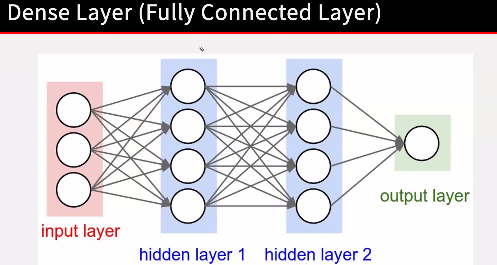

* 4층의 모델

* 동그라미가 뉴런 (노드)

* 모든 게 다 연결되어있다고 해서 Fully

* 딥러닝에 가장 기본이 되는 레이어라서 매우 중요함

* 햄버거의 패티 역할이라고 보면 된다.

  * output layer이 가장 중요함
  * 뉴런의 개수 
  * 하고자하는 분류 개수 = output 뉴런 개수 
  * 데이터가 몇 군데에서 들어오는 지 설정

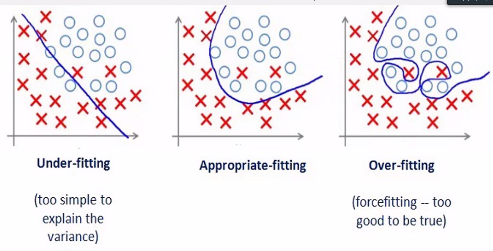

* 일반화를 잘 시켜야함. Generation.

* Train 과 Validation을 각각 만들어야한다.

* 이미지셋을 10000장이 있다면, 일정 부분을 떼서 8000장만 가지고 학습하고 나머지는 검증용 셋으로 설정한다.

* 검증이 연한 파랑

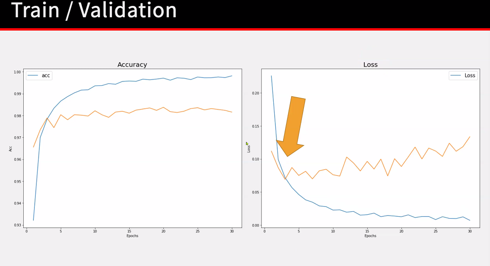

* 파랑이 훈련셋 노랑이 검증셋. 과적합 주의 접점을 잘 찾아내야한다.

* 항상 4세트 (훈련의 xy, 검증의 xy)

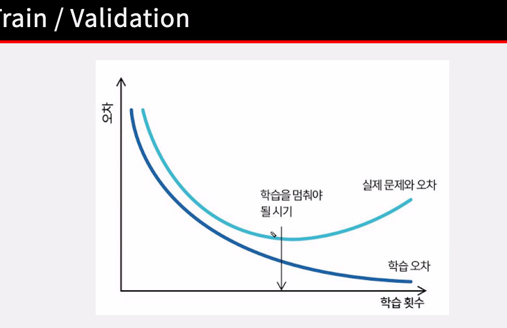

* 학습시간이 생각보다 매우 오래걸릴 수 있음. 

* 자면서도 시기가 나올 수 있다. => 도와주는 아이. ModelCheckpoint

* 최고의 Accuracy 혹은 Loss 가 나온 epoch을 임시 저장해줌

* 이미지 rescale

* 하나하나가 픽셀데이터

=> Normalization(정규화, 표준화?) = 모든 픽셀 값이 0~1 사이의 값을 가지도록 한다. 거의 필수

학습속도가 빨라짐

* 원핫인코딩

  * 문자열 => 숫자열

  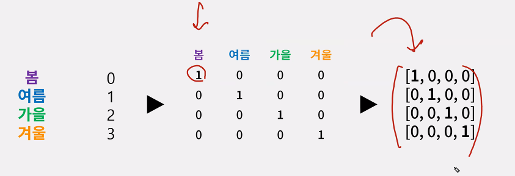

* Dense = 선형함수

* Dense 3 => y = ax+bx+cx

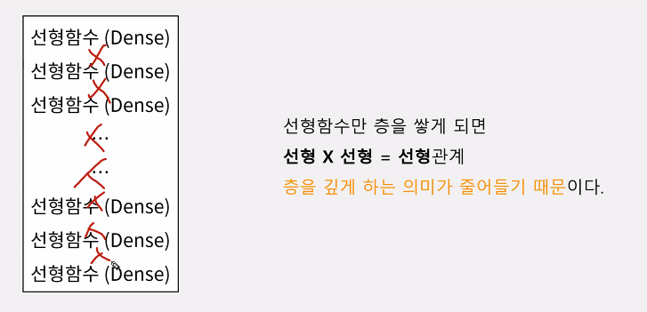

* 비선형은 잘 풀어내지 못 함. 자율주행 음성 영상 = 비선형데이터! 요즘 핫한 것들

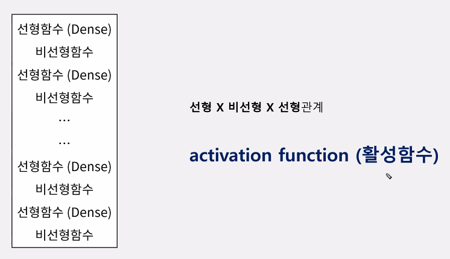

=> 그래서 활성함수!

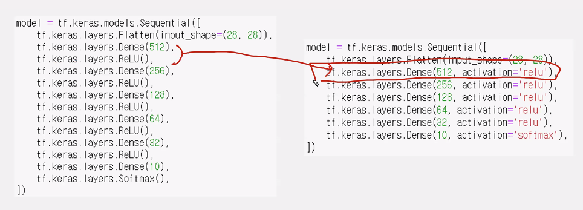

* 이렇게 축약함

* 히든은 무조건 relu

* 가장 중요!!! 마지막에는 sigmoid나 softmax

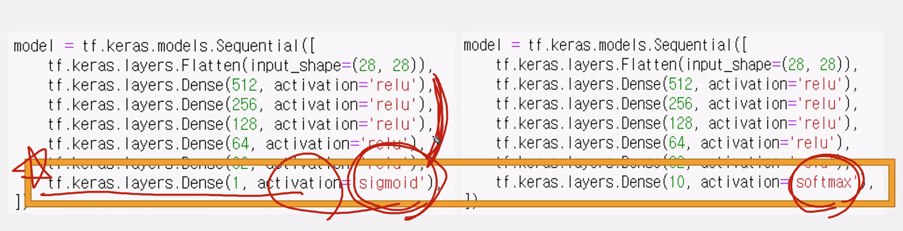

x에 뭘 넣든 y는 0~1로 나옴

* 반드시 뉴런 = 노드 = 1일때. 결과값을 sigimoid에 넣어주면 0~1로 값이 나옴

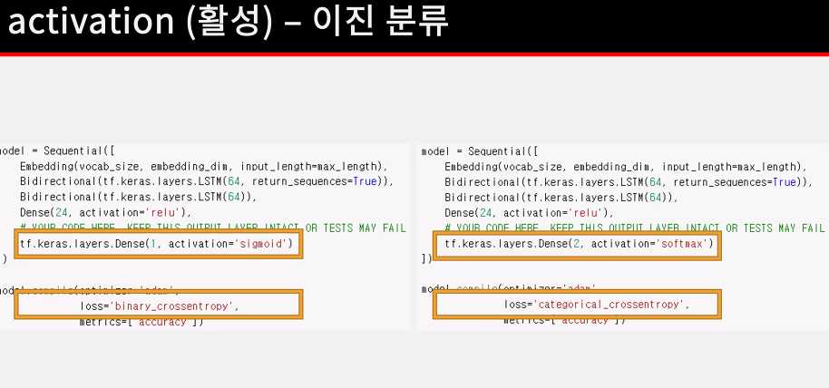

* 분류해야하는 클래스가 두개밖에 없을 때! 예를 들어 사람동물.

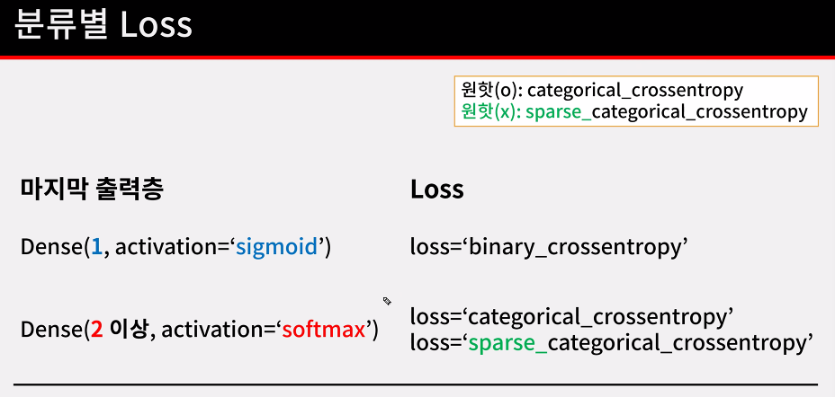

* 분류해야할 클래스의 개수 = Dense
* relu는 0보다 크면 자기자신을 반환함. 히든레이어
* metrics 평가지표 설정
* 그라디언트 소실에 관해서 => https://youtu.be/CQwzsNDpE1c
* (사진 개수, 세로길이, 가로길이, RGB)

